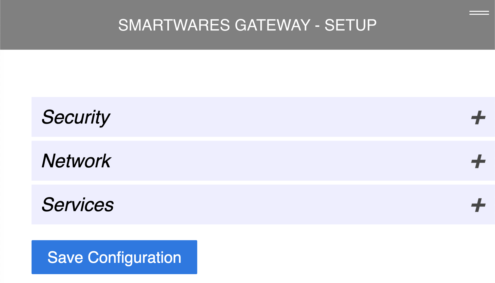
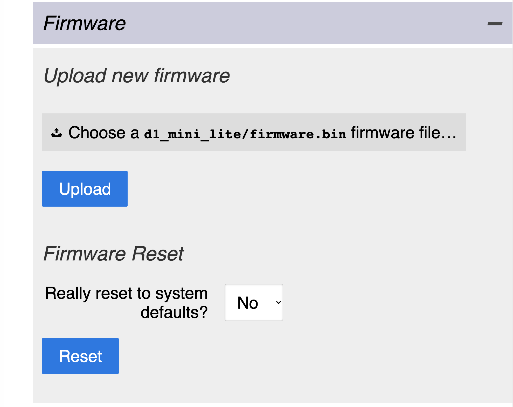

# ESP8266-SH4-99751-Gateway - Documentation

Some screenshots, not a real documentation at this time.

## Homepage

## Homepage with menu

## Info page

## Setup page

### Security settings

### Network settings

#### General Settings - Hostname

#### Wifi settings

#### Interface settings

### Services

#### MQTT settings

#### Telnet

#### Over The Air (OTA) settings

#### NTP (Timeservice) settings

## Maintenance

### Backup & Restore Configuration

### Upload new firmware, Firmware reset

